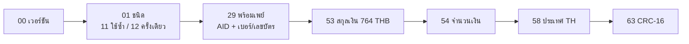

# 💸 KANAO PromptPay QR

[](https://github.com/adisorn6302565/KANAO-PromptPay-QR/actions/workflows/pages.yml)


เว็บสร้าง QR รับเงินพร้อมเพย์ ระบุยอดเงินได้ สแกนได้กับแอปธนาคารไทยทุกแอป ทำงานในเบราว์เซอร์ทั้งหมด **ไม่มี server ไม่ส่งเบอร์หรือยอดเงินออกไปไหน**

## 🌐 ใช้งานออนไลน์

**https://adisorn6302565.github.io/KANAO-PromptPay-QR/**

1. ใส่เบอร์พร้อมเพย์ (10 หลัก), เลขบัตรประชาชน / เลขผู้เสียภาษี (13 หลัก) หรือ e-Wallet ID (15 หลัก)
2. ใส่จำนวนเงิน หรือเว้นว่างให้ผู้จ่ายกรอกเอง
3. QR ขึ้นทันที → **ดาวน์โหลด PNG** / **พิมพ์** / **คัดลอกลิงก์** ส่งให้ลูกค้า

ลิงก์ที่คัดลอกจะเปิดหน้านี้พร้อมข้อมูล เช่น `...?to=0812345678&amount=150&name=ร้านของฉัน`

## ✨ ฟีเจอร์

- QR ตามมาตรฐาน Thai QR Payment (EMVCo) พร้อม CRC-16 ถูกต้อง
- มียอดเงิน = QR ใช้ครั้งเดียว (dynamic), ไม่มียอด = ใช้ซ้ำได้ (static)
- ตรวจ checksum เลขบัตรประชาชน กันพิมพ์ผิด
- โปสเตอร์ PNG ความละเอียดสูง มีชื่อร้าน / เบอร์ / ยอดเงิน, สั่งพิมพ์ได้เลย
- จำเบอร์และชื่อไว้ในเครื่อง (เลือกเปิดได้), รองรับ dark mode และมือถือ

## 🧩 โครงสร้างข้อมูลใน QR



เบอร์โทรจะถูกแปลงเป็นรูปแบบสากล เช่น `0812345678` → `0066812345678`

## 💻 รันในเครื่อง

ต้องมี [Node.js 22+](https://nodejs.org/)

```bash
npm install
npm run dev      # เปิดเว็บทดสอบ
npm test         # ทดสอบการสร้าง payload / CRC / เลขบัตร
npm run build    # ไฟล์ static ใน dist/
```

**Deploy:** push เข้า `main` → GitHub Actions รันเทสต์ build แล้วขึ้น GitHub Pages อัตโนมัติ

```text
├── index.html
├── src/
│   ├── promptpay.ts        # สร้าง payload + CRC-16 + ตรวจเลขบัตร
│   ├── promptpay.test.ts
│   ├── main.ts             # หน้าจอ + วาด QR + โปสเตอร์ PNG
│   └── style.css
└── .github/workflows/pages.yml
```
